


 

  

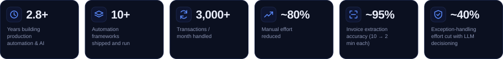

  


> **“Turning LLMs, tools and data into real-world AI systems.”**

I like starting from a messy export, an email thread or someone walking me through their process, then working out what should be built and shipping it. I build day to day with **Claude Code** and **Cursor**.

 

<a href="https://github.com/Shubham261299/agentic-case-routing-orchestrator">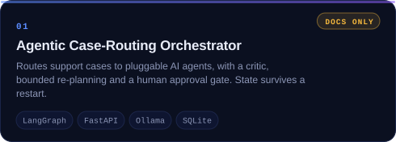</a>
<a href="https://github.com/Shubham261299/enterprise-mcp-layer">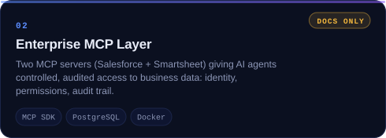</a>
<a href="https://github.com/Shubham261299/agentic-tool-orchestrator">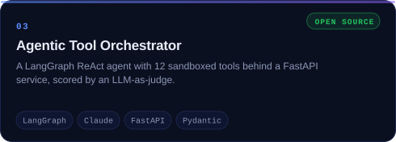</a>
<a href="https://github.com/Shubham261299/opspilot">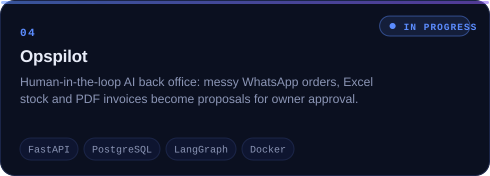</a>
<a href="https://github.com/Shubham261299/self-healing-invoice-automation">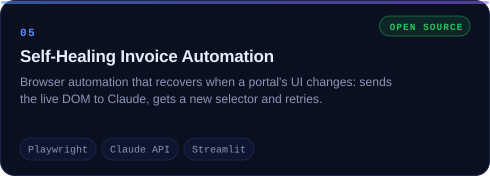</a>
<a href="https://github.com/Shubham261299/daybook">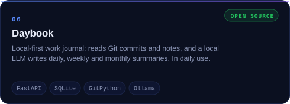</a>
<a href="https://github.com/Shubham261299/sop-assistant">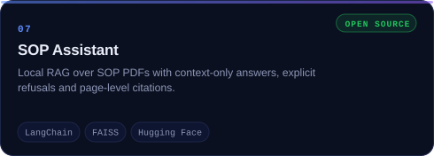</a>
<a href="https://shubham-ai-lab.vercel.app/">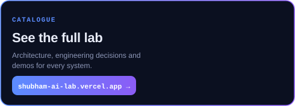</a>

The Case-Routing Orchestrator and the Enterprise MCP Layer were built at my current employer, so their source is proprietary. Those repos document the architecture, the design decisions and the results.

 

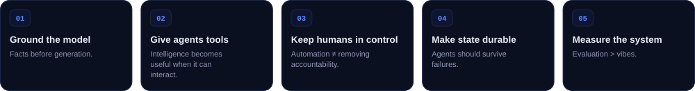

 

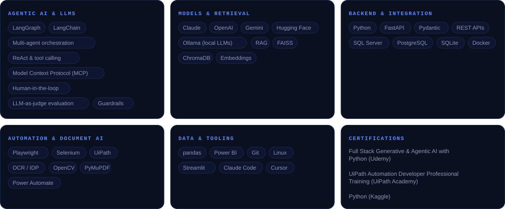

 

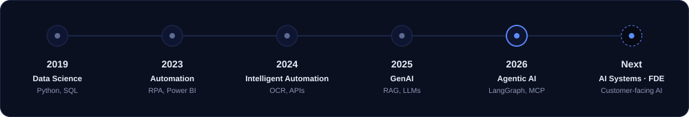

 

### 💼 Experience

**Automation Engineer · IDeaS Revenue Solutions** · *Jul 2026 – present*

- Multi-agent case-routing orchestrator with a critic, bounded re-planning and a human approval gate
- Salesforce and Smartsheet MCP servers, deployed internally, with per-agent permissions and audit logs
- Salesforce → G3 report automation (Playwright, SQL Server, Outlook/VBA) and a local-LLM report pipeline

**Analyst · Searce** · *Dec 2023 – Jul 2026*

- 10+ Python automations for logistics and accounts-payable teams: 3,000+ transactions/month, ~80% less manual effort
- Invoice document processing (OCR + carrier APIs): ~10 → ~2 minutes per invoice at ~95% accuracy
- LLM decisions in exception handling (~40% less effort) and a RAG assistant for SOPs

 

<picture>
  <source media="(prefers-color-scheme: dark)" srcset="https://raw.githubusercontent.com/Shubham261299/Shubham261299/output/github-snake-dark.svg">
  
</picture>

 

I'm open to **AI Engineering, Agentic AI, AI Solutions and Forward Deployed Engineer** roles. If you're working on AI agents, MCP, intelligent workflows or production LLM systems, I'd be happy to connect.

